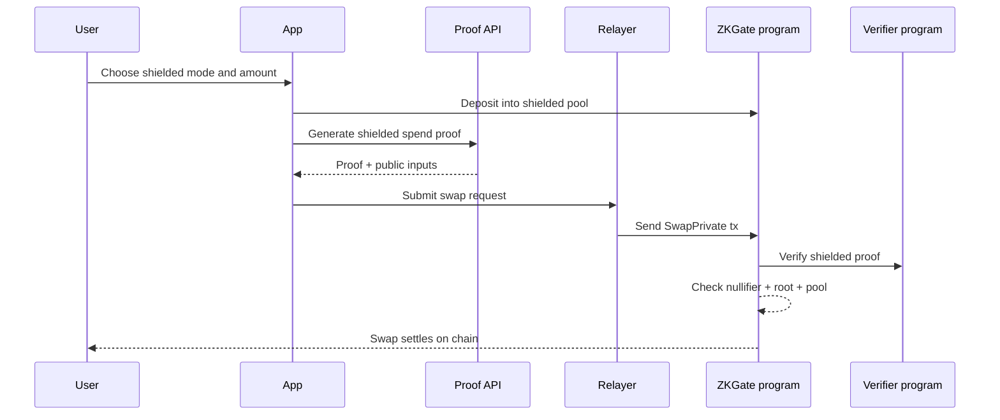
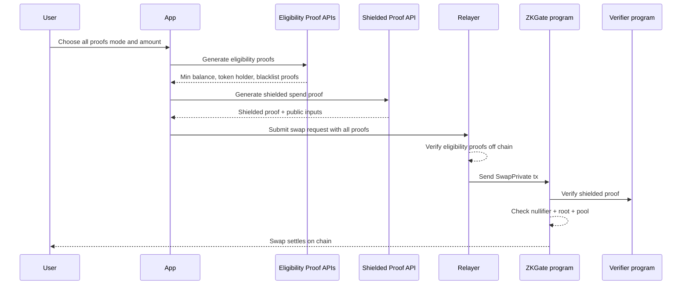

# Shadow DEX Technical Explanation

This is a short explanation of how Shadow works under the hood.  

## One sentence summary

Shadow lets a user prove they meet a swap requirement without revealing the data behind that proof.

## What is private today

- Private: the user eligibility data, and which shielded note they spent.
- Visible on chain: token mints, amounts, pool, and the swap outputs.

## The basic flow

1. The user selects a proof mode and a swap amount.
2. The app creates a shielded note and deposits into a shielded pool.
3. The server generates the selected ZK proof using Noir and Sunspot.
4. A relayer submits the swap transaction and pays the fee.
5. The on-chain program verifies the proof and executes the swap.

## Swap flow diagrams

Shielded mode swap flow:

All proofs mode swap flow:

## The proof modes in this demo

Shadow ships four proof modes:

- **Min Balance**  
  Proves the user has at least X tokens without revealing the exact balance.

- **Token Holder**  
  Proves the user holds at least Y of a specific token.

- **Not Blacklisted**  
  Proves the user is not on a blacklist.

- **Shielded Spend**  
  Proves the user owns a note in the shielded pool and prevents double spend with a nullifier.

## How the proofs are verified

- The shielded spend proof is verified on chain by the verifier program.
- The program checks the nullifier to prevent double spends.
- The relayer verifies any eligibility proofs before it submits the swap.

## Shielded mode vs all proofs mode

Both modes submit the same `SwapPrivate` instruction on chain and verify the same shielded spend proof.  
The difference is off chain:

- **Shielded mode** only uses the shielded spend proof.
- **All proofs mode** also verifies three eligibility proofs in the relayer before it submits the transaction.

Those extra proofs do not appear on chain today. The transaction logs only show the shielded proof verification.

## Why proofs are generated on the server

Sunspot currently runs most smoothly in a server environment.  
That is why the proof APIs live on the server today.  
This is a demo tradeoff and can move client-side when tooling improves.

## Demo limitations we are aware of

Min balance and token holder proofs are bound to real SPL token account data by hashing the account bytes.  
They still do not verify against a global Solana state root.  
Blacklist exclusion is still simplified in this demo.  
Root updates require a configured root authority key so the on-chain root history stays in sync.
We are actively working on the fixes listed below.

## What is left and how we plan to finish it

This is the straightforward plan to make the remaining proof modes production ready:

1. **Real state roots**  
   Replace the placeholder roots with a real state root source and verify Merkle inclusion against it.

2. **Proper non-membership proofs**  
   Swap the blacklist check for a real Merkle non-membership proof.

3. **Client side proofs when tooling is ready**  
   Move proof generation to the client when Sunspot support is stable for that flow.

4. **On-chain eligibility verification**  
   Add verifier programs for the eligibility circuits or aggregate them into one proof so the program can enforce all checks on chain.

## Where this goes next

- A durable pool service that stores and syncs Merkle roots.
- Shielded outputs so amounts and recipients are private.
- Larger anonymity sets with batching and relayer routing.
- Production hardening like key management and monitoring.
