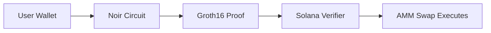

# Shadow DEX

**The first privacy-preserving DEX on Solana where you prove eligibility without revealing yourself**

[](https://solana.com)
[](https://noir-lang.org)
[](LICENSE)

## Live Demo

**[View a successful ZK-gated swap on Solana Explorer →](https://explorer.solana.com/tx/2g7pEECWBRJ2KF3pztzDKY2GLxcBz3ybDjR1ysfg2JKVpvkQuMowT11APKQKoh5MAn7egm2mFo9whVD5UQm7QCpY?cluster=devnet)**

Transaction highlights:
- ✅ Groth16 ZK proof verified on-chain
- ✅ Swap: 1 Token A → 0.9348 Token B (0.3% fee)
- ✅ Total: 497k compute units

## The Problem

Traditional DeFi has a privacy problem. To participate in gated pools (whale-only, VIP tiers, KYC'd users), you must **expose your wallet balance** or identity. This creates:
- **Privacy leaks** — Anyone can see your holdings
- **Front-running risk** — Bots can analyze your activity
- **Personal safety risks** — Large holders become targets

## The Solution

Shadow uses **zero-knowledge proofs** to verify eligibility without revealing sensitive data:

```
Traditional: "Here's my balance: $50,000" → Pool grants access
Shadow:      "I can prove balance ≥ $10,000" → Pool grants access
```

**You prove you meet the threshold without revealing your actual balance.**

## How It Works



1. **User** enters swap amount in the UI
2. **Noir circuit** (`min_balance`) proves balance ≥ threshold
3. **Sunspot** converts proof to Groth16 format
4. **On-chain verifier** validates the proof (~470k compute units)
5. **AMM** executes the token swap

## 🛠️ Tech Stack

| Component | Technology | Purpose |
|-----------|------------|---------|
| **ZK Circuits** | [Noir](https://noir-lang.org) | Write privacy-preserving proofs |
| **Proof System** | [Sunspot](https://github.com/reilabs/sunspot) | Compile Noir → Groth16 for Solana |
| **Smart Contract** | [Anchor](https://anchor-lang.com) | Solana program with ZK verification |
| **On-chain Verifier** | gnark-verifier-solana | Verify Groth16 proofs on-chain |
| **Frontend** | Next.js + React | Wallet connection & proof generation |
| **Proof API** | Next.js API Routes | Server-side Groth16 proof generation |

## 🚀 Quick Start

```bash
# Clone and setup
git clone https://github.com/Some1UKnow/shadow
cd shadow
```

📖 **[Full Setup Guide →](GUIDE.md)**

## 📂 Project Structure

```
shadow/
├── programs/zkgate/     # Anchor smart contract
├── circuits/            # Noir ZK circuits
│   └── min_balance/     # Proves balance ≥ threshold
├── app/                 # Next.js frontend
│   └── src/app/api/prove/  # Proof generation API
└── scripts/             # Deployment & setup scripts
```

## 🔑 Key Innovation

**First DEX using Noir ZK proofs verified on Solana.**

- ✅ Real on-chain Groth16 verification (not trusted backend)
- ✅ Privacy-preserving eligibility (balance hidden)
- ✅ Full-stack: circuits → proofs → verification → swap

## 📊 Deployed on Devnet

| Contract | Address |
|----------|---------|
| **Shadow DEX** | `GXJ3CW71zDWP8ejuougsMicsLvZbMr4H1B2n2KvtLuK9` |
| **ZK Verifier** | `95uEYS5q8LnrfgxAGbZwYn5gbSfsbmRPKiibF5a9P2Qz` |

## 📜 License

MIT License

---

**Built with 🖤 by Shadow Team**
